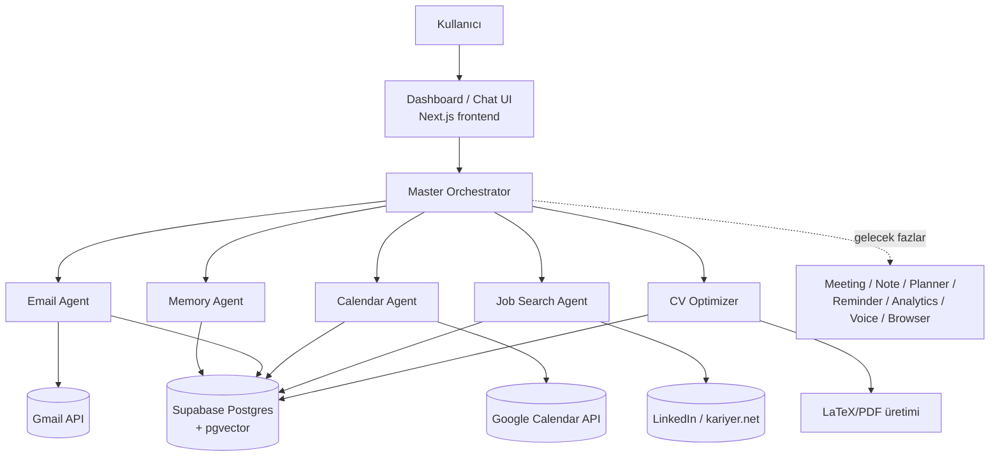

# ARCHITECTURE.md — Sistem Mimarisi

**Durum:** Faz 1 için önerilen mimari. Deployment detayları (bkz. §7)
henüz kesinleşmedi — `DEPLOYMENT.md` (Faz 2) içinde netleştirilecek.

## 1. Teknoloji seçimi ve gerekçe

Kullanıcı önceliği: **kolay ve ücretsiz**. Buna göre:

| Katman | Seçim | Gerekçe |
|---|---|---|
| Dil | TypeScript (uçtan uca) | Frontend + backend tek dil, Claude Agent SDK ve Vercel AI SDK ile birinci sınıf destek, tip güvenliği |
| Framework | Next.js (App Router) | Frontend + API routes tek projede; Vercel'in ücretsiz Hobby planıyla sıfır-config deploy |
| Veritabanı | Supabase (Postgres) | Cömert ücretsiz katman, yerleşik Auth (Google OAuth dahil), Storage, ve `pgvector` (AI_MEMORY için embedding/RAG desteği ücretsiz) |
| AI motoru | Google Gemini API (`@google/genai`, `gemini-2.5-flash`) | Anthropic Claude API kullanım-bazlı ücretli olduğu için (kredi kartı + minimum bakiye gerektiriyor), kişisel/düşük hacimli kullanım için kredi kartı istemeyen gerçek ücretsiz katmanı olan Gemini tercih edildi. Function calling desteği Orchestrator'ın araç-yönlendirme mantığı için yeterli. Bkz. §8. |
| Arka plan işleri | Vercel Cron (ücretsiz, sınırlı) veya hafif bir worker (Faz 2'de netleşecek) | E-posta/takvim polling, hatırlatma tetikleyicileri için |
| Kimlik doğrulama | Supabase Auth + Google OAuth | Gmail/Calendar erişimi için zaten gereken OAuth akışını Auth ile birleştirir |

Bu yığın, `Dashboard-Project/is-basvuru` becerisinin bugün kullandığı
"kod yok, salt prompt/skill" yaklaşımından farklıdır — çünkü bu proje
kalıcı durum (e-posta geçmişi, hafıza, takip kayıtları), OAuth token
yönetimi ve arka planda çalışan görevler gerektirir. `is-basvuru`
mantığı (scrape/apply) bu projeye **agent olarak taşınacak/adapte
edilecek**, birebir kopyalanmayacak.

## 2. Üst düzey bileşen diyagramı



## 3. Master Orchestrator deseni

Orchestrator, kullanıcının doğal dil isteğini alır, hangi uzman
ajan(lar)ın gerekli olduğuna karar verir (Claude'un tool-use / agent
routing yeteneğiyle), ilgili ajanı çağırır, sonucu birleştirir ve
kullanıcıya sunar. Her uzman ajan kendi sistem promptuna (bkz.
`PROMPTS.md`, Faz 2) ve sınırlı bir araç setine sahiptir — Orchestrator
hiçbir ajanın "her şeyi yapabilir" hale gelmesine izin vermez (asgari
yetki ilkesi, bkz. `SECURITY.md`).

**Onay katmanı:** Dış dünyaya giden her eylem (e-posta gönder, davet
oluştur, başvuru gönder) Orchestrator seviyesinde bir "taslak → kullanıcı
onayı → gönder" adımından geçer. Bu, `is-basvuru` becerisinin "asla
otomatik gönderim yapma" kuralının tüm asistana genellenmiş hâlidir.

## 4. Veri akışı (MVP örneği: "Bugünkü e-postalarımı özetle")

1. Kullanıcı dashboard'da isteği yazar → UI, Orchestrator'a iletir.
2. Orchestrator isteği sınıflandırır → Email Agent'a yönlendirir.
3. Email Agent, Gmail API'den (OAuth token Supabase Auth'tan) son
   e-postaları çeker, Memory Agent'tan kullanıcı önceliklerini
   (ör. "müşteri e-postaları öncelikli") okur.
4. Email Agent özet + öncelik sıralaması üretir, sonucu Orchestrator'a
   döner.
5. Orchestrator sonucu kullanıcıya sunar; kullanıcı bir e-postaya
   taslak yanıt isterse aynı akış "taslak oluştur" moduna geçer ve
   gönderim onay bekler.
6. İşlem özeti Supabase'e (audit/geçmiş için) yazılır.

## 5. Klasör yapısı (kök dizin)

```
ai-executive-assistant/
├── CLAUDE.md              # Claude Code için ana kurallar
├── README.md               # proje tanıtımı
├── docs/                   # tüm ürün/mimari dokümantasyonu
├── agents/                 # her ajan için: sistem promptu + araçlar + testler
├── backend/                 # Next.js API routes, iş mantığı, Orchestrator
├── frontend/                # Next.js dashboard UI (chat arayüzü)
├── mobile/                  # (Faz 3+, şimdilik boş — bkz. ROADMAP)
├── api/                      # dış/iç API sözleşmeleri (OpenAPI vb.)
├── database/                 # şema, migration'lar (Supabase)
├── integrations/              # servis bazlı OAuth/connector kodu (gmail/, google-calendar/, ...)
├── prompts/                   # ajan sistem promptları (bkz. PROMPTS.md)
├── automation/                 # otomasyon akış tanımları (bkz. AUTOMATION.md)
├── tests/                       # test suite'leri
└── deployment/                   # IaC / deploy konfigürasyonu
```

Bu yapı, kullanıcının talep ettiği kurumsal şablonla birebir uyumludur.
Faz 1'de `backend/`, `frontend/`, `agents/`, `database/`,
`integrations/` aktif olarak doldurulacak; `mobile/`, `api/`,
`prompts/`, `automation/`, `tests/`, `deployment/` iskelet olarak
duracak ve ilgili faz geldiğinde doldurulacak (bkz. `ROADMAP.md`).

## 6. Ajan ↔ Orchestrator sözleşmesi (özet)

Her ajan:
- Net bir görev tanımına sahiptir (bkz. `AGENTS.md`).
- Yalnızca ihtiyaç duyduğu araçlara/verilere erişir (asgari yetki).
- Girdi/çıktısı Orchestrator'ın anlayacağı yapılandırılmış bir formatta
  olur (ör. `{status, summary, requiresApproval, draft}`).
- Kendi başına dış dünyaya kalıcı bir eylem *göndermez* — taslak üretir,
  onay Orchestrator/kullanıcı katmanında verilir.

## 7. Dağıtım (önerilen, netleşmemiş)

Kullanıcı "kolay ve ücretsiz" istediği için önerilen varsayılan:
**Vercel (Hobby, ücretsiz) + Supabase (Free tier)**. Arka plan
işlerinin (polling, hatırlatmalar) ücretsiz katmanlarda nasıl
çalışacağı (Vercel Cron sınırları vs. ayrı bir worker) `DEPLOYMENT.md`
içinde Faz 2'de netleştirilecek — bu, kullanıcının deployment kararını
henüz vermemiş olmasından dolayı bilinçli olarak açık bırakılmıştır.

## 8. Uygulama durumu (Faz 1 dikey dilim)

İlk çalışan dikey dilim kuruldu: `frontend/` tek bir Next.js projesi
olarak Chat UI + `/api/chat` route + Master Orchestrator + Email Agent
+ Calendar Agent + Gmail/Google Calendar connector'ları (mock/gerçek
sağlayıcı seçimli, aynı `GOOGLE_CLIENT_ID/SECRET/REFRESH_TOKEN`
kimlik bilgileriyle) içeriyor. Calendar Agent şu an yalnızca okuma
yapıyor (özet + LLM tabanlı çakışma tespiti) — etkinlik oluşturma/
düzenleme, dış dünyaya giden bir eylem olduğu için ayrı bir taslak/
onay akışı gerektiriyor ve henüz eklenmedi (bkz. `ROADMAP.md`).
Bununla
birlikte §5'teki klasör planında küçük bir sadeleştirme yapıldı:
`agents/`, `integrations/`, `backend/` klasörleri henüz ayrı paketler
değil — kod fiilen `frontend/src/lib/agents/` ve
`frontend/src/lib/integrations/` altında yaşıyor, o üç klasör de
kendi `README.md`'lerinde bunu açıklayan birer yönlendirme notuyla
duruyor. Gerekçe: tek tüketici (tek Next.js app) varken ayrı npm
paketlerine bölmek gereksiz soyutlama olurdu; birden fazla tüketici
(ör. Faz 2 background worker) ortaya çıktığında çıkarılacak.

Çalıştırmak için: `frontend/.env.example` dosyasını
`frontend/.env.local` olarak kopyalayıp en az `GEMINI_API_KEY` girin
(ücretsiz, kredi kartı gerektirmez — https://aistudio.google.com/apikey),
ardından `cd frontend && npm install && npm run dev`.
`GOOGLE_CLIENT_ID`/`SECRET`/`REFRESH_TOKEN` girilmezse Email Agent
otomatik olarak demo verisiyle (`MockEmailProvider`) çalışır.

**Not — AI motoru değişikliği:** İlk taslakta Anthropic Claude API
kullanılmıştı; kullanıcı testinde Claude API'nin ücretsiz bir katmanı
olmadığı (minimum bakiye/kredi kartı gerektirdiği) ortaya çıkınca,
"kolay ve ücretsiz" ilkesine sadık kalmak için Google Gemini API'ye
geçildi (bkz. §1 tablosu). `getGeminiClient()` (`src/lib/llm.ts`) tek
giriş noktası olduğu için ileride farklı bir sağlayıcıya geçiş de aynı
şekilde tek dosyada izole kalır.

**Not — canlı doğrulama (Vercel + gerçek Gmail/Calendar):** İlk dikey
dilim `ai-executive-assistant-uerc.vercel.app` adresinde Vercel Hobby
üzerinde deploy edildi (Root Directory: `frontend`, Production Branch:
`claude/claude-md-docs-r1b40g`). Google Cloud tarafında bir OAuth
istemcisi oluşturulup Gmail API + Google Calendar API etkinleştirildi;
elde edilen `GOOGLE_CLIENT_ID/SECRET/REFRESH_TOKEN` Vercel ortam
değişkenlerine girildi. Sonuç: Email Agent, Calendar Agent ve Morning
Briefing artık `MockEmailProvider`/`MockCalendarProvider` yerine
kullanıcının gerçek Gmail/Calendar verisiyle canlı ortamda çalışıyor
ve doğrulandı.

**Not — Job Search Agent + CV Optimizer, ortam kaynaklı uyarlamalar:**
Mantık `Dashboard-Project/is-basvuru/.claude/skills/{scrape,apply}`'den
taşındı (`frontend/src/lib/agents/job-search-agent.ts`); `profil.md` ve
`reviewer-kriterleri.md` kardeş repodan birebir kopyalanıp
`frontend/src/lib/agents/job-search/` altında TypeScript string
sabitleri olarak paketlendi (`.md` dosyalarını build-time'da fs ile
okumak yerine — Vercel'in serverless fonksiyon bundling'i yalnızca
import edilen modülleri izler, çalışma zamanında fs.readFileSync
edilen dosyalar deploy'a dahil olmayabilir; bu, OAuth kurulumunda
yaşanan Vercel yapılandırma sürprizlerinden çıkarılan bir ders).
Yürütme ortamı iki noktada orijinal beceriden ayrışıyor:
1. **CV çıktısı PDF değil, Markdown.** Vercel serverless'ta `pdflatex`
   toolchain'i çalıştırmak pratik değil; çıktı tek sütunlu Markdown'a
   uyarlandı (`cv-template.ts`) — bu aynı zamanda
   `reviewer-kriterleri.md`'nin önerdiği ATS-güvenli tek sütun formatı
   varsayılan olarak sağlıyor. Sabit bölümler (deneyim, eğitim,
   sertifika, ödül) `profil.md`'den programatik olarak (regex ile)
   çıkarıldı — elle kopyalanmadı, sadakat garantisi için.
2. **Otomatik ilan TARAMASI yok.** `scrape` becerisinin LinkedIn/
   kariyer.net arama-sonucu taraması bu sürümde uygulanmadı (bulk
   scraping riski + Vercel'de headless tarayıcı çalıştırmanın pratik
   olmaması); yalnızca kullanıcının verdiği tek bir ilan metni/URL'si
   değerlendiriliyor (`job-posting.ts`, tek istek). Bu, kapsamı
   daraltıyor ama orijinal beceri de zaten arama sonuçları için
   kullanıcı onaylı bir URL istiyordu (bkz. `scrape/SKILL.md` adım 2).

Başvuru takip günlüğü (`ApplicationTracker`, `job-tracker.ts`) aynı
Mock/gerçek sağlayıcı deseniyle kuruldu: Supabase kimlik bilgisi
girilmemişse (`NEXT_PUBLIC_SUPABASE_URL` boş) oturum-bazlı bellekte
tutulur — kalıcı değildir, soğuk başlatmada kaybolur; kalıcılık için
Supabase kurulumu gerekir (bkz. `.env.example`).

## 9. Geleceğe dönük genişleme noktaları

- **Outlook/Microsoft 365/Teams:** `integrations/` altına yeni bir
  connector eklenerek; Orchestrator ve Email/Calendar Agent'lar
  sağlayıcıdan bağımsız bir arayüz (`EmailProvider`,
  `CalendarProvider`) üzerinden çalışacak şekilde tasarlanmalı —
  bugünden Gmail'e sıkı bağlı (hard-coded) yazılmamalı.
- **Çoklu kullanıcı:** Bugün tüm veri modeli tek kullanıcı varsayımıyla
  kurulur; `user_id` alanları yine de şemaya eklenir (bkz.
  `DATABASE.md`, Faz 2) ki ileride çoklu kullanıcıya geçiş şema
  göçü gerektirmesin — ama yetkilendirme/izolasyon mantığı Faz 1'de
  kurulmaz.
